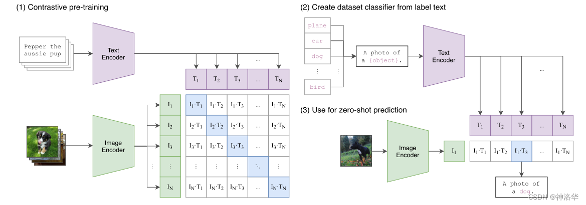
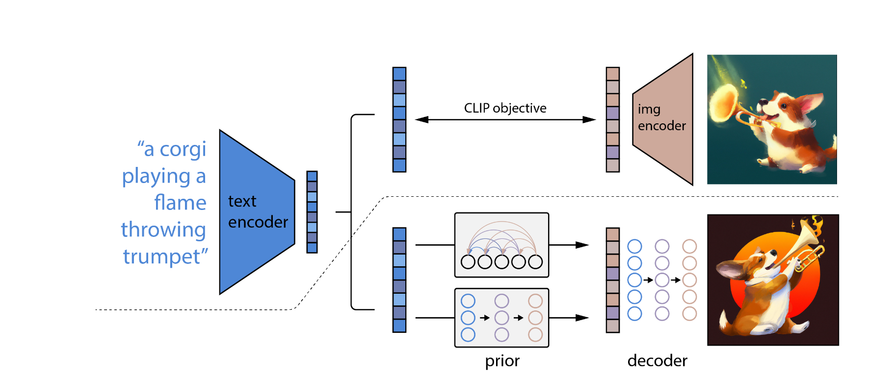
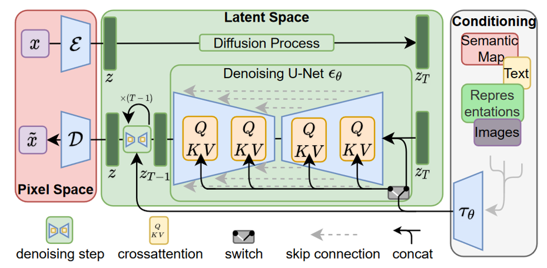

# 
 图文多模态 

## CLIP概述
CLIP是OpenAI在2021年2月发表的一篇文章，其全称为Contrastive Language-Image Pre-training，即一种基于对比文本-图像对的预训练方法。CLIP用文本作为监督信号来训练可迁移的视觉模型，使得最终模型的**zero-shot**效果堪比ResNet50，泛化性非常好，而且CLIP还有很多好玩的应用，并广泛应用于多模态大模型中。
  

*注：zero-shot，即零样本学习，是指训练集中未出现的样例却会在实际测试与使用时碰到。例如训练集中有马和斑马线，而测试时模型能够识别出斑马*
  
论文：https://arxiv.org/abs/2103.00020

---

## CLIP 训练过程
- 输入：\
CLIP的输入是一对对配对好的的图片-文本对。例如“狗”这一文本与狗的照片。

- 数据处理：\
将文本经过text encoding，图像经过image encoding，得到维度相同的两个特征。 
接着在这两个特征上进行对比学习

- 度量标准：\
假设有n对输入，计算这n组文本与图像特征的相似度，同组相似度越大越好，异组则越小越好。 

---

## CLIP 的意义与应用

### 意义
CLIP将图像与文本映射到了同一语义空间下，因此赋予图像准确的语义信息。通过大语言模型强大的理解能力，CLIP成功地解决图像的零样本学习问题，这同时是图像文本多模态模型的重要前提。

### 零样本分类问题

- 根据任务的分类标签构建每个类别的描述文本：A photo of {label}，然后将这些文本送入Text Encoder得到对应的文本特征。如果类别数目为n，那么将得到n个文本特征。
- 将要预测的图像送入Image Encoder得到图像特征，然后与n个文本特征计算缩放的余弦相似度（和训练过程保持一致），然后选择相似度最大的文本对应的类别作为图像分类预测结果。进一步地，可以将这些相似度看成logits，送入softmax后可以到每个类别的预测概率。

由此我们不再需要提前定好分类类别，同时收获了比原先分类模型更好的鲁棒性，换句话说，**CLIP让模型能够理解图像的语义信息，而不仅仅是图像本身**。

---

## CLIP在多模态大模型的应用

**Dalle2**如图所示

论文：https://arxiv.org/abs/2204.06125

### 阶段1：CLIP训练
方式相同，只是大模型训练数据量更大

### 阶段2：生成模型训练
- 训练一个prior模型，一般是扩散模型，将clip的输出当作外部prompt与扩散模型融合
- 训练图像解码器，将扩散模型的特征变为图片

此后我们便可以用文本控制图像的生成了。

**Stable-Diffusion**如图所示

