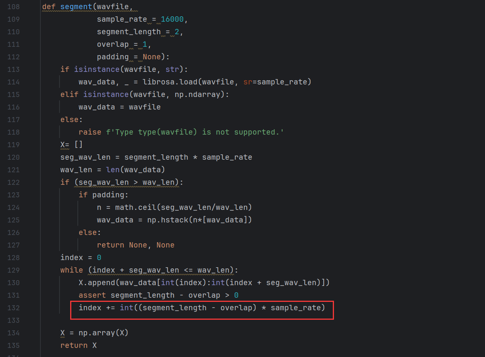
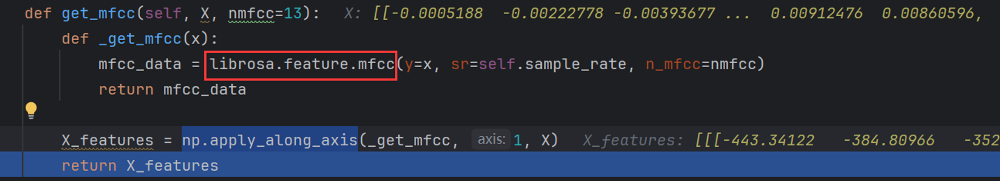
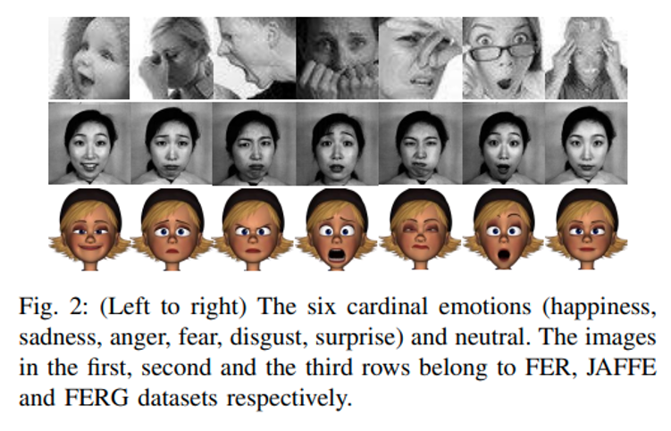
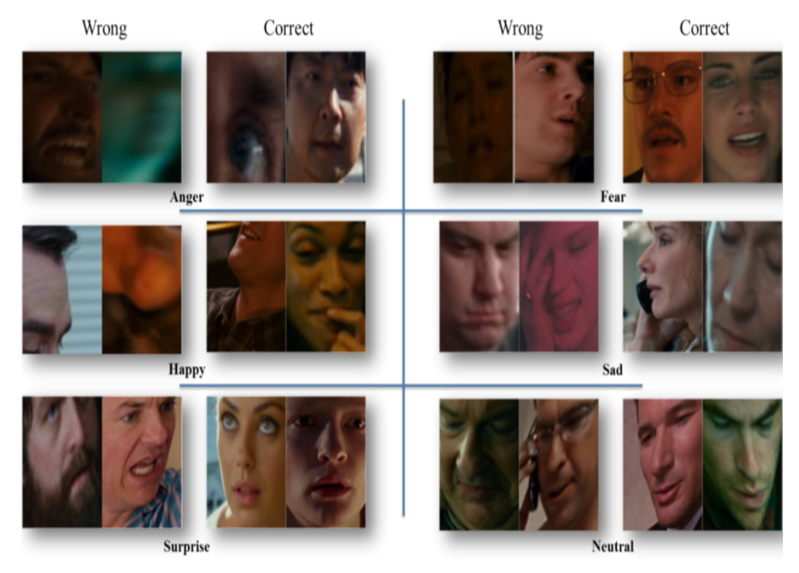
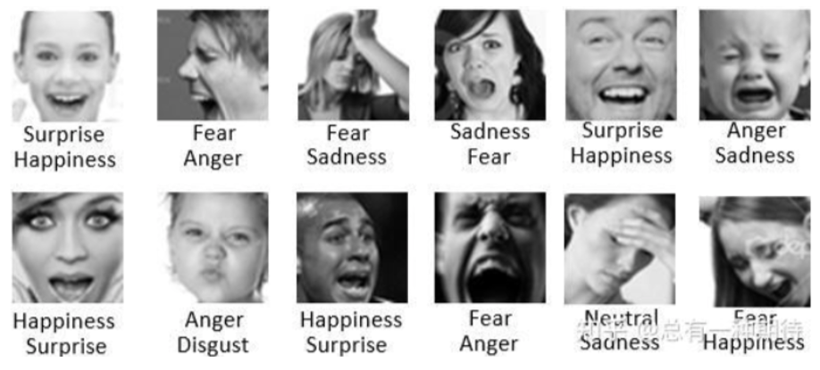
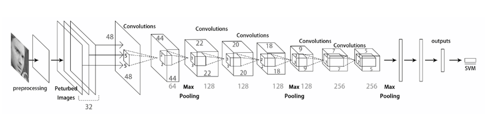
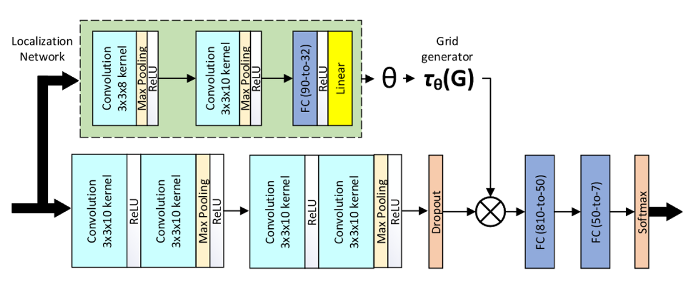
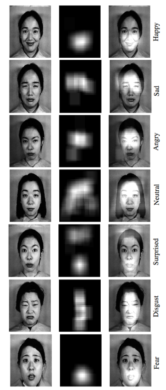
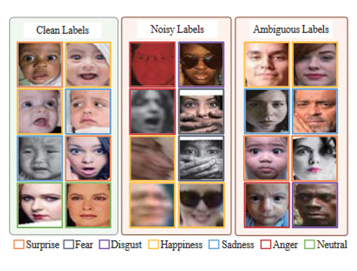
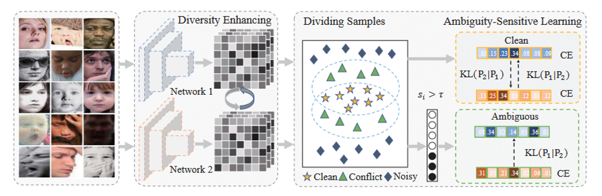

# 情感计算：facial emotion recognition

### 1. 上次的遗漏（关于wav具体输入的问题）

> 可以看到，输入是一条（或四条）细长的tensor（举例：[1, 100000]）。在经过分段、采样（这里相邻采样之间有重合部分）与最后的mfcc，可以得到一个比较规整的可以丢到网络里去的tensor，如图1所示。

### 2. FER背景介绍

- 数据集组织形式：

  

  > 常见的FER数据集就是一张图加一个标签（表示了什么情绪），相对来说，上图给出的FER、JAFFE和FERG会比较干净（不但指错标比较少，也表示不太会有模糊的情绪）

- 存在的问题：

  

  > 有可能没有很好的捕捉到“脸”的位置，导致后续处理的有效性和准确性下降

  

  > 现实中，这种多标签的数据是很常见的，但是这却没有在现在的数据集里体现出来
  >
  > 并且，在实际的模型应用中，会存在很多的“模糊”样本，不单单指图片清晰度不够，也代表着图片的情绪模糊

- 经典模型

  

  > Facial Expression Recognition with Deep learning

  这篇是最早的将深度学习应用于FER的一批论文之一，模型比较简单，最后加上了SVM做分类器，最后得到了65%左右的准确度，基本没有考虑前面提到的那些问题。

  有个在线的网页可以使用他们的模型https://cs230-fer.firebaseapp.com/

  # 

  

  > Deep-Emotion: Facial Expression Recognition Using Attentional Convolutional Network

  这篇论文对于之前的改进在于，增加了一个spatial transformer，让模型有了更强的能力去聚焦局部的特征对整体判断的影响，如下图所示：

  

  > 这里，不同的情绪所关注的部分就有区别，比如惊喜就在额头，恐惧就在嘴

  # 

  

  

  > EASE: Robust Facial Expression Recognition via Emotion Ambiguity-Sensitive Cooperative Networks

  这则是聚焦于之前提到的模糊问题与多标签问题进行了优化，具体来说就是使用两个结构一样的网络分别对这些图片进行预测，然后根据两个网络的预测差别，将数据集分成clean、noise和ambiguous三个部分，然后只选取clean和ambiguous的部分数据进行最终训练。

  值得注意的是，为了避免在训练后期两个模型趋同而带来的模型退化，这篇文章在loss function上做了手脚，具体如下：
  $$
  \ell_1=(1-\lambda-\gamma)\ell_{ce}(S)+\lambda\ell_{KL}(S)+\gamma e(f_k^{'})
  $$

  $$
  \ell_{KL}(p_1(I^1\cap I^2)|p_2(I^1\cap I^2))=\sum_{i=1}^{|I^1\cap I^2|}\sum_{j=1}^Cp_1^j(x_i)\log\frac{p_1^j(x_i)}{p_2^j(x_i)}
  $$

  简单来说就加大了两个模型预测结果趋同的惩罚:)