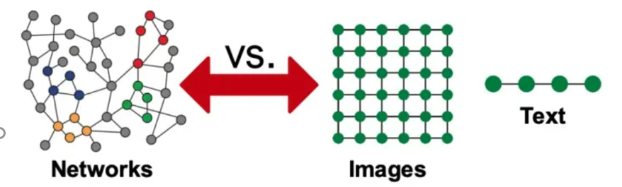

## GNN能做什么(和CNN相比)

近十年来(从2012年AlexNet开始计算)，深度学习在计算机视觉(CV)和自然语言处理(NLP)等领域得到的长足的发展，深度神经网络对于图像和文字等欧几里得数据(Euclidean data)可以进行较好的处理

但是现实世界是复杂的，如社交网络，一个人的朋友数量是不固定的，也很难排个顺序，这类复杂的非欧几里得数据(non-Euclidean)，没有上下左右，没有顺序，没有坐标参考点，难以用方方正正的(grid-like)矩阵/张量表示，为了把不规则的脚(非欧数据)穿进标准的鞋(神经网络)里，之前干了不少削足适履的事，效果不太好，于是，问题变成了：能否设计一种新的鞋，使它能适合不规则的脚呢？

非欧数据的场景很多，除了上面提到的社交网络，其他例子如：计算机网络，病毒传播路径，交通运输网络(地铁网络)，食物链，粒子网络，(生物)神经网络，基因控制网络，分子结构，知识图谱，推荐系统，论文引用网络等等。这些场景的非欧数据用图(Graph)来表达是最合适的，但是，经典的深度学习网络(ANN,CNN,RNN)却难以处理这些非欧数据，于是，图神经网络(GNN)应运而生，GNN以图作为输入，输出各种下游任务的预测结果。

下游任务包括但不限于：
•节点分类：预测某一节点的类型
•边预测：预测两个节点之间是否存在边
•社区预测：识别密集连接的节点所形成的簇
•网络相似性: 两个(子)网络是否相似

## NN的特性

本文主要以CNN为例，介绍GNN中三个核心思想——**局部性(Locality)**、**汇聚(Aggregation)**、**组合(composition)**

### CNN的介绍

CNN的本质是将一个像素和其周围像素值通过卷积核进行**汇聚**，经过**组合**多层卷积结果后生成高层特征向量，这个向量包含图像多个特征，为下游任务(分类预测，聚类等)提供基础。
在上述任务中，**局部性**体现在卷积核对一个像素周围像素进行处理，实现全图范围的权值共享，同时卷积参数量远小于全连接神经网络，**汇聚**体现在一个像素周围像素参与卷积核的点积运算，具体如下图所示

经过多次卷积和汇聚，最后生成特征向量()上图粉色部分向量表示特征，可以作为下游任务算法的输入
而对于**局部性**的解释个人认为上述卷积过程中一个像素点的周围像素值参与卷积决定新的特征向量，影响到当前向量值
其实在RNN中上述三个核心思想也有类似体现，在此不过多赘述

### GNN-节点特征学习
首先，

