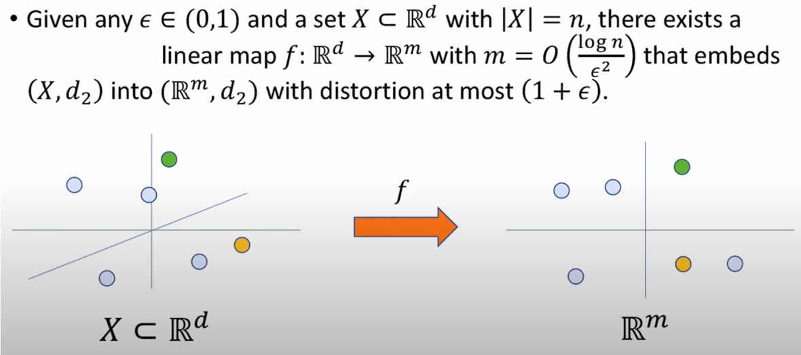
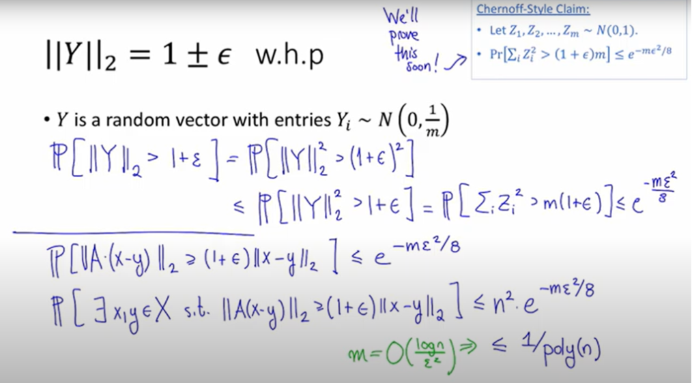
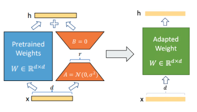

# Influence function 

> http://arxiv.org/abs/2402.04333

1. #### Purpose

   > *Given just a a handful of examples embodying a specific capability, how can we effectively select relevant fine-tuning data from a large collection of instruction datasets?*

   

2. #### Influence function with Adam(LESS)

   - Tayor expansion
     $$
     \ell\left(\boldsymbol{z}^{\prime} ; \boldsymbol{\theta}^{t+1}\right) \approx \ell\left(\boldsymbol{z}^{\prime} ; \boldsymbol{\theta}^t\right)+\left\langle\nabla \ell\left(\boldsymbol{z}^{\prime} ; \boldsymbol{\theta}^t\right), \boldsymbol{\theta}^{t+1}-\boldsymbol{\theta}^t\right\rangle
     $$

     $$
     \boldsymbol{\theta}^{t+1}-\boldsymbol{\theta}^t=-\eta_t \nabla \ell\left(\boldsymbol{z} ; \boldsymbol{\theta}^t\right)
     $$

     $$
     \ell\left(\boldsymbol{z}^{\prime} ; \boldsymbol{\theta}^{t+1}\right)-\ell\left(\boldsymbol{z}^{\prime} ; \boldsymbol{\theta}^t\right) \approx-\eta_t\left\langle\nabla \ell\left(\boldsymbol{z} ; \boldsymbol{\theta}^t\right), \nabla \ell\left(\boldsymbol{z}^{\prime} ; \boldsymbol{\theta}^t\right)\right\rangle
     $$

   - Trajectory influence
     $$
     \operatorname{Inf}_{\mathrm{SGD}}\left(\boldsymbol{z}, \boldsymbol{z}^{\prime}\right) \triangleq \sum_{i=1}^N \bar{\eta}_i\left\langle\nabla \ell\left(\boldsymbol{z}^{\prime} ; \boldsymbol{\theta}_i\right), \nabla \ell\left(\boldsymbol{z} ; \boldsymbol{\theta}_i\right)\right\rangle
     $$

   - Extension to Adam
     $$
     \begin{gathered}
     \boldsymbol{\theta}^{t+1}-\boldsymbol{\theta}^t=-\eta_t \Gamma\left(\boldsymbol{z}, \boldsymbol{\theta}^t\right) \\
     \Gamma\left(\boldsymbol{z}, \boldsymbol{\theta}^t\right) \triangleq \frac{\boldsymbol{m}^{t+1}}{\sqrt{\boldsymbol{v}^{t+1}+\boldsymbol{\epsilon}}} \\
     \boldsymbol{m}^{t+1}=\left(\beta_1 \boldsymbol{m}^t+\left(1-\beta_1\right) \nabla \ell\left(\boldsymbol{z} ; \boldsymbol{\theta}^t\right)\right) /\left(1-\beta_1^t\right) \\
     \boldsymbol{v}^{t+1}=\left(\beta_2 \boldsymbol{v}^t+\left(1-\beta_2\right) \nabla \ell\left(\boldsymbol{z} ; \boldsymbol{\theta}^t\right)^2\right) /\left(1-\beta_2^t\right)
     \end{gathered}
     $$

   - Adam Influence
     $$
     \operatorname{Inf}_{\text {Adam }}\left(\boldsymbol{z}, \boldsymbol{z}^{\prime}\right) \triangleq \sum_{i=1}^N \bar{\eta}_i \frac{\left\langle\nabla \ell\left(\boldsymbol{z}^{\prime} ; \boldsymbol{\theta}_i\right), \Gamma\left(\boldsymbol{z}, \boldsymbol{\theta}_i\right)\right\rangle}{\left\|\nabla \ell\left(\boldsymbol{z}^{\prime} ; \boldsymbol{\theta}_i\right)\right\|\left\|\Gamma\left(\boldsymbol{z}, \boldsymbol{\theta}_i\right)\right\|}
     $$
     

3. #### Problems&Improvements

   - Random Projection (JL lemma)

     

     

   - Lora

     