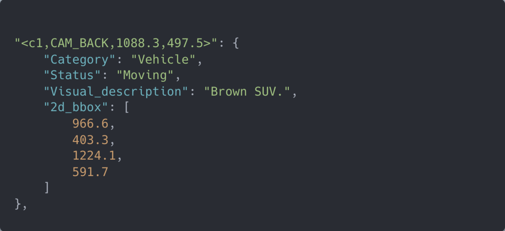

# LLM 初探

NLP 的简单介绍和一些特征

## Causal LLM 推理过程

- 输入为文本，可能有一些特殊的字符串（`<|eos|>`）等。
- 经过 Tokenizer，变为一个 token 数组
- token 数组进入模型，生成数组的下一个值的概率分布，取概率最高的（或者前几个里随机取）。
- 如此循环，不断延长数组。
- 到了该结束的位置，将新生成的 tokens 通过 Tokenizer 转换为文本。

## LLM 领域的特征

- 模型大、训练成本高
- Transformer 依旧几乎是唯一使用的架构，在自注意力这一方面几乎没有变化，几个 Attention 层之间的小层（前馈神经网络、LayerNorm 之类）是改进的重点
- 几乎不从头训练：绝大多数论文都是微调或者类似微调的方面的成果，做预训练的几乎都是商业公司（ OpenAI, Meta, Mistral, 阿里 ）
- 预训练模型的潜力极大：几乎所有的下游任务模型都可以从预训练模型里微调出来

## 和原始的 Transformer Decoder 有何区别？

以 LLAMA 2 为例

- 位置编码从三角函数变为 RoPE（性能）
- Attention 计算使用 GQA （算力）
- layerNorm 改为 RMSNorm （算力）
- 对输入做 Norm，而不是输出 （性能）
- FFN 中激活函数从 Relu 改为 SwiGLU （性能）


## 训练过程


## 微调？拼接 Prompt！

典型的微调文本：

```
Below is an instruction that describes a task. Write a response that appropriately completes the request. 
### Instruction: Create a function to calculate the sum of a sequence of integers. 
### Input: [1, 2, 3, 4, 5] 
### Output: 
# Python code 
def sum_sequence(sequence): 
sum = 0
for num in sequence: 
sum += num return sum
```

## 多轮对话？

( Mistral Instruct )

```
<s>[INST] You are a helpful code assistant. Your task is to generate a valid JSON object based on the given information. So for instance the following:

name: John
lastname: Smith
address: #1 Samuel St.

would be converted to:[/INST]
{
"address": "#1 Samuel St.",
"lastname": "Smith",
"name": "John"
}
</s>
[INST]
name: Ted
lastname: Pot
address: #1 Bisson St.
[/INST]
```

## Prompt engineering




## LLM Agent


## Toolformer

自学习的 API 调用

